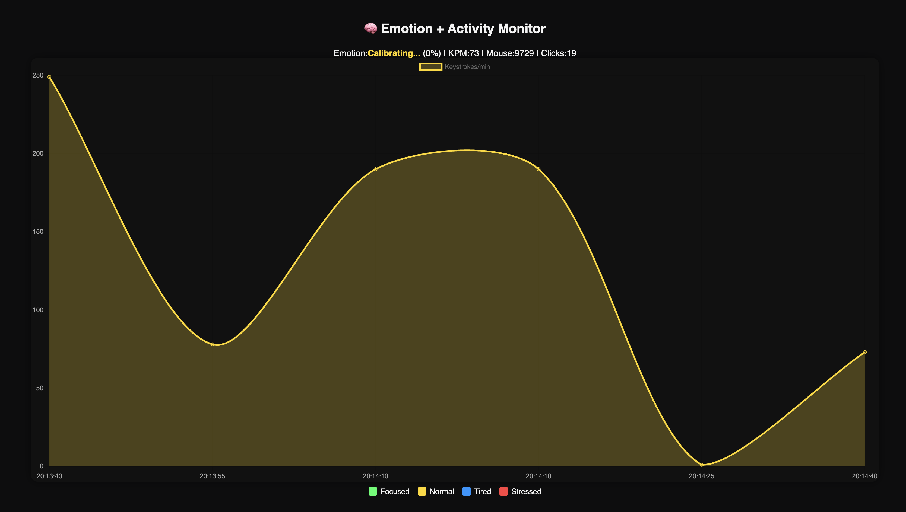
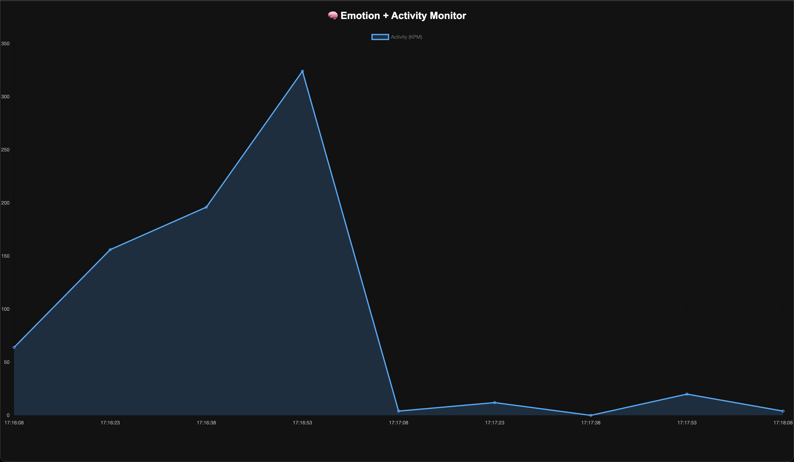
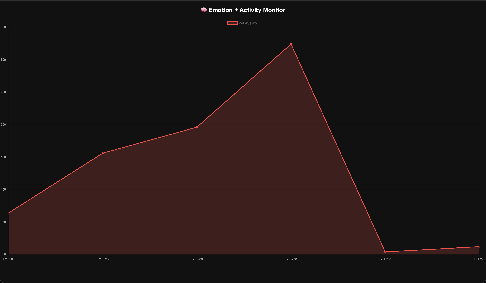
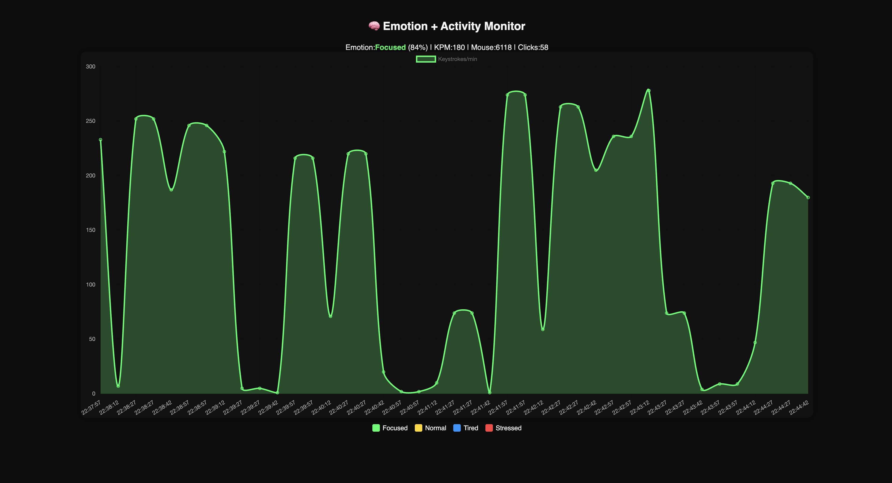
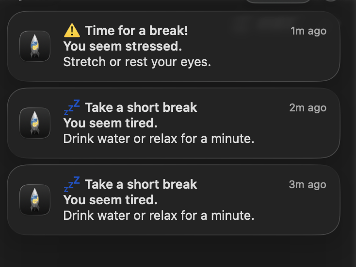

# 🧠 Emotion + Activity Monitor  
### Real-Time Emotion Recognition & Productivity Tracker (v10)

A lightweight, privacy-focused macOS menubar app that monitors typing and mouse activity to detect emotional and productivity states — such as **Focused**, **Normal**, **Tired**, and **Stressed** — in real-time.  

Built with **Python**, **Flask**, and **menubar integration**, the app visualizes keystrokes, mouse activity, and emotional trends with an interactive dashboard.

---

## 🚀 Features

- 🧩 **Real-Time Emotion Detection**
  - Detects Focused, Normal, Tired, and Stressed states using behavioral patterns  
- 📊 **Dynamic Activity Dashboard**
  - Displays live keystrokes per minute, mouse movements, and emotional states  
- 🔔 **Smart Notifications**
  - Sends “Take a Break” or “You Seem Stressed” alerts intelligently (only when needed)  
- 🖥️ **macOS Menubar Integration**
  - Runs quietly in the menubar with a minimal interface  
- 🧘‍♂️ **Auto-Pause Feature**
  - Pauses monitoring when you click “Pause” and resumes automatically  
- 📁 **Lightweight Logs**
  - Logs are stored locally for transparency and data control  

---

## 🖼️ Screenshots & Visuals  

| 🟢 Focused | 🟡 Normal | 🔵 Tired |
|------------|-----------|-----------|
|  |  |  |

| 🔴 Stressed | 📈 Dashboard | 🔔 Notifications |
|-------------|--------------|------------------|
|  |  |  |

---

## 🧠 Emotion Classification Logic

| State | Color | Condition |
|--------|--------|------------|
| **Focused** | 🟢 Green | High typing & mouse activity, consistent pattern |
| **Normal** | 🟡 Yellow | Stable average levels of interaction |
| **Tired** | 🔵 Blue | Drop in activity rate for a sustained period |
| **Stressed** | 🔴 Red | Irregular burst activity or excessive input rate |

---

## ⚙️ Installation

### 1️⃣ Clone the repository
```bash
git clone https://github.com/DHAIRYA027/EmotionMonitor.git
cd EmotionMonitor
```

### 2️⃣ Install dependencies
```bash
pip install -r requirements.txt
```

### 3️⃣ Run the app
```bash
python3 emotionMonitor_v10.py
```

Then visit the dashboard at  
➡️ [http://localhost:8080](http://localhost:8080)

---

## 🧩 Project Structure

```
EmotionMonitor/
│
├── emotionMonitor_v10.py           # Main application
├── model/                          # Model / emotion classification logic
├── logs/                           # Local logs folder
├── dashboard.html                  # Front-end dashboard
├── requirements.txt                # Dependencies
├── setup.py                        # Packaging setup
└── docs/screenshots/               # Project visuals
```

---

## 🪄 Future Improvements
- 🧍‍♂️ Add webcam-based emotion detection (optional)
- 📅 Weekly activity summary chart
- 💤 Smart idle detection for longer inactivity
- ☁️ Cloud sync (optional, private toggle)

---

## 👨‍💻 Developer
**Dhairya Prabhakar**  
💡 Built with passion, calm, and caffeine ☕  

📫 GitHub: [@DHAIRYA027](https://github.com/DHAIRYA027)  
🧩 Project Repository: [EmotionMonitor](https://github.com/DHAIRYA027/EmotionMonitor)

---

### 📜 License
This project is released under the **MIT License** — free to modify and adapt with attribution.

---

> _“Emotion awareness is the first step to mindful productivity.”_
